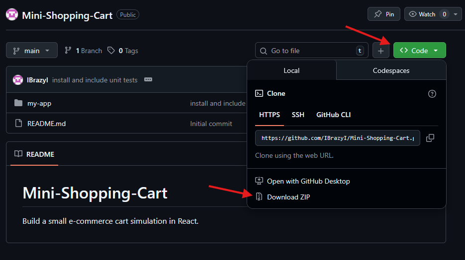

# Mini-Shopping-Cart
TASK - Build a small e-commerce cart simulation in React.

## Description
This app is a small e-commerce frontend called "Doomsday Supply Shop". I have hard coded the shop items and created a basic shopping cart functionality based on adding specific amounts of the items up to a stock limit to the basket. Then within the basket being able to change the amounts of each product and also remove the item from the basket entirely. There is a sub total of each of the items costs and then a total cost. The buy now button triggers an alert to say the items have been purchased and resets the app. The basket contents are saved in local storage and upon purchase completion the local storage is wiped.

## Running the App
1. Navigate to the GitHub URL [https://github.com/IBrazyI/Mini-Shopping-Cart]
2. Click the green "Code" button and clone/download the code in your preferred way ("Download Zip" for this example.)
[]

